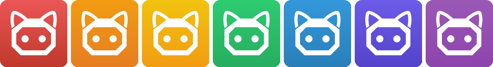

<p align="center">
  
</p>

<h1 align="center">MeowHub (喵控)</h1>

<p align="center">
  <b>AI Phone Avatar — Create Your Own Phone Automation Skills with AI</b>
</p>

<p align="center">
  <a href="https://tutuai.me">Official Website</a> •
  <a href="README_CN.md">中文文档</a> •
  <a href="docs/skill-development-guide.md">Skill Development Guide</a> •
  <a href="skills/">Skill Gallery</a> •
  <a href="CONTRIBUTING.md">Contributing</a>
</p>

<p align="center">
  <a href="LICENSE"></a>
  
  
  
  <a href="https://github.com/zhaojiaqi/MeowHub/stargazers"></a>
  <a href="https://github.com/zhaojiaqi/MeowHub/network/members"></a>
  <a href="https://github.com/zhaojiaqi/MeowHub/issues"></a>
</p>

---

## What is MeowHub?

MeowHub is an open-source Android app that turns your phone into an **AI-powered automation agent**. It serves as **the hands and feet of AI in the physical world** — enabling AI to truly "see" your screen, "tap" buttons, and "swipe" through apps to accomplish any task on your phone. MeowHub runs entirely on your device, is fully open-source, and uses a declarative **Skill Engine** so you can create and share automation skills in JSON — no coding required.

**Our vision:** Everyone can create and share their own phone AI avatar skills — giving AI the power to interact with the physical world.

### Why MeowHub? — A Fundamental Difference from Accessibility-Based Solutions

Most phone automation tools (Auto.js, Hamibot, Accessibility-based solutions, etc.) rely on Android's **AccessibilityService** to perform actions. This approach has critical flaws:

| | Accessibility-Based Solutions | MeowHub (ADB-Based) |
|---|---|---|
| **Implementation Level** | Application-layer API, sandboxed | System-level ADB protocol, same as developer debugging tools |
| **Stability** | Prone to breakage from OS updates, inconsistent across OEM ROMs | Standard ADB protocol ensures consistent and stable behavior |
| **Detection Risk** | **High Risk** — Major apps like WeChat, TikTok, Taobao, and Alipay actively detect Accessibility Services, triggering risk controls or even **account bans** | **Zero Detection Risk** — ADB operations happen at the system level, completely transparent to target apps, equivalent to real finger touches, undetectable by applications |
| **Permission Management** | Requires manual Accessibility permission grants; some systems repeatedly prompt or auto-revoke | One-time pairing, persistent connection, no repeated authorization |
| **Operation Scope** | Limited to UI elements with Accessibility nodes; unable to handle games/Canvas/WebView | Supports touch, swipe, and key input at any screen position, framework-agnostic |

**In short: Accessibility-based solutions are "sneaking around on someone else's turf" — always at risk of being detected and blocked. MeowHub's ADB approach is "operating with system-level authority" — stable, secure, and undetectable.**

### The Hands and Feet of AI — More Than Automation

MeowHub is not just another RPA tool. Through deep integration with Large Language Models (LLMs), MeowHub becomes **the bridge between AI and the physical world (your phone)**:

- **AI can "See"** — Screenshots + vision analysis let AI understand anything on screen
- **AI can "Think"** — Based on current screen state and context, AI makes intelligent decisions
- **AI can "Act"** — Through system-level ADB operations, AI decisions are translated into precise touches, swipes, and inputs — real physical actions
- **AI can "Learn"** — The declarative Skill system enables AI capabilities to accumulate and evolve

This makes MeowHub one of the few open-source solutions that lets AI **truly reach physical devices and execute real-world actions**. It's not simulating, it's not calling APIs — it's using your phone, operating like a human.

### Key Features

- **Skill Engine** — A declarative JSON-based automation engine supporting 15+ step types: API calls, AI vision analysis, conditional branching, loops, user prompts, and more
- **AI-Powered Actions** — Leverages LLM (Large Language Model) to understand screenshots, locate UI elements, and make intelligent decisions
- **System-Level ADB** — Fully self-contained ADB implementation with mDNS discovery, TLS pairing (SPAKE2), and RSA key persistence — no PC required, zero detection risk
- **Skill Marketplace** — Browse, search, and run community-created skills with one tap
- **Overlay Control** — Floating panel for quick actions and real-time skill execution status
- **Open Ecosystem** — Create your own skills in JSON, contribute to the community, and build your personal phone AI avatar

### How It Works

```
┌──────────────────┐
│   MeowHub App    │
│  (Skill Engine)  │
└────────┬─────────┘
         │ ADB Protocol (TLS)
         ▼
┌──────────────────┐
│   ADB Daemon     │
└────────┬─────────┘
         │ shell: app_process
         ▼
┌──────────────────┐      ┌─────────────┐
│  TutuGui Server  │◄────►│  AI Provider │
│ (scrcpy-server)  │      │  (LLM API)   │
└────────┬─────────┘      └─────────────┘
         │ JSON Socket
         ▼
┌──────────────────┐
│ Touch / Swipe /  │
│ Screenshot / UI  │
└──────────────────┘
```

## Screenshots

<!-- TODO: Add screenshots or GIF demos -->

<p align="center">
  <i>Screenshots coming soon...</i>
</p>

## Getting Started

### Prerequisites

| Requirement | Version |
|------------|---------|
| Android    | 9+ (API 28), recommended 11+ for wireless debugging |
| Java       | 17 |
| Kotlin     | 2.3.10 |
| Android Gradle Plugin | 9.0.1 |
| Gradle     | 9.2.1 |
| NDK        | 28.x (CMake 3.22.1) |

### Build

1. **Clone the repository**

```bash
git clone https://github.com/zhaojiaqi/MeowHub.git
cd MeowHub
```

2. **Configure secrets**

Copy the example configuration and fill in your API keys:

```bash
cp secrets.properties.example secrets.properties
```

Edit `secrets.properties` with your credentials:

```properties
DOUBAO_API_KEY=your_api_key_here
DOUBAO_BASE_URL=https://ark.cn-beijing.volces.com/api/v3
DOUBAO_MODEL_ID=your_model_id_here
TUTU_APP_ID=your_app_id_here
TUTU_APP_SECRET=your_app_secret_here
```

> **Doubao API key**: Obtain from [Volcengine](https://www.volcengine.com/product/doubao). The AI provider is pluggable — contributions for other LLM providers (OpenAI, Gemini, etc.) are welcome!
>
> **TUTU_APP_ID / TUTU_APP_SECRET**: Used to connect to TUTU Smart Control device services. Visit the [project official website](https://tutuai.me), log in, go to **User Center** → **TUTU API KEY**, and click "Apply for API KEY" to get your App ID and App Secret.

3. **Build and install**

```bash
./gradlew assembleDebug
./gradlew installDebug
```

### First Run

1. Enable **Wireless Debugging** in Developer Settings on your Android device
2. Open MeowHub and follow the pairing wizard
3. Once connected, browse the Skill Marketplace or run a skill from "My Skills"

## Skill Ecosystem

MeowHub's power comes from its **extensible Skill system**. Skills are defined in simple JSON files and can automate virtually anything on your phone.

### Built-in Skills (19+)

| Category | Skills |
|----------|--------|
| Social | WeChat Auto Reply, WeChat Moments Like, Check Messages, Add Friend |
| Entertainment | Browse TikTok, TikTok Skip Ads, Browse Xiaohongshu |
| Daily | Check Weather, Daily News, Set Alarm, SMS Summary |
| Shopping | Taobao Search, Meituan Food |
| Tools | Screen Translate, Photo Cleanup, Storage Cleanup, WiFi Diagnose, Phone Health Check, Eye Comfort |

### Create Your Own Skill

Skills are JSON files with a declarative step-by-step structure. Here's a minimal example:

```json
{
  "name": "hello-world",
  "display_name": "Hello World",
  "version": "1.0.0",
  "steps": [
    {
      "id": "check_screen",
      "type": "ai_check",
      "prompt": "Describe what you see on the screen",
      "save_as": "screen_info"
    },
    {
      "id": "report",
      "type": "ai_summary",
      "prompt": "Summarize: ${screen_info}",
      "output": "result"
    }
  ]
}
```

For the complete guide, see **[Skill Development Guide](docs/skill-development-guide.md)**.

### Contributing Skills

We encourage everyone to create and share skills! Submit your skills via Pull Request to the [`skills/`](skills/) directory. See [CONTRIBUTING.md](CONTRIBUTING.md) for details.

## Tech Stack

| Layer | Technology |
|-------|-----------|
| UI | Jetpack Compose + Material 3 |
| State | ViewModel + StateFlow / SharedFlow |
| Navigation | Navigation Compose |
| Network | Kotlinx Serialization JSON + Custom Socket Protocol |
| ADB | Self-implemented ADB v2 (TLS, SPAKE2 Pairing) |
| Native | CMake + C++ (BoringSSL SPAKE2) |
| AI | Pluggable AI Provider (Doubao / Custom) |

## Project Structure

```
app/src/main/java/com/tutu/meowhub/
├── core/
│   ├── adb/          # Wireless ADB protocol stack
│   ├── auth/         # Token authentication
│   ├── engine/       # Skill execution engine (core)
│   ├── model/        # Data models
│   ├── network/      # MeowHub API client
│   ├── repository/   # Data repository
│   ├── service/      # Foreground services
│   └── socket/       # TutuSocketClient (TCP)
├── feature/
│   ├── debug/        # Debug panel
│   ├── engine/       # Skill engine ViewModel
│   ├── market/       # Skill marketplace UI
│   ├── myskills/     # My skills UI
│   ├── navigation/   # Main navigation
│   ├── overlay/      # Floating overlay
│   └── settings/     # Settings & ADB control
└── ui/theme/         # Material 3 theme
```

## Acknowledgements

MeowHub stands on the shoulders of these amazing open-source projects:

- **[scrcpy](https://github.com/Genymobile/scrcpy)** — The brilliant screen mirroring tool that inspired our device control layer. MeowHub's TutuGui Server is built upon scrcpy-server.
- **[Shizuku](https://github.com/RikkaApps/Shizuku)** — Pioneered the approach of using ADB for app-level privilege elevation on Android, which greatly inspired our wireless ADB implementation.

Special thanks to the developers and communities behind these projects. Their work has made MeowHub possible.

## Author

**zivzhao** — [Official Website](https://tutuai.me) · [GitHub](https://github.com/zhaojiaqi) · [Email](mailto:zivzhao@icloud.com)

## License

MeowHub is licensed under the **GNU General Public License v3.0** — see the [LICENSE](LICENSE) file for details.

```
Copyright (C) 2025 zivzhao and MeowHub Contributors

This program is free software: you can redistribute it and/or modify
it under the terms of the GNU General Public License as published by
the Free Software Foundation, either version 3 of the License, or
(at your option) any later version.
```

### Help Wanted

We especially welcome contributions that improve the **Skill Engine's core algorithms**:

- **RPA Execution Efficiency** — Optimize step execution flow, reduce unnecessary waits, improve command batching
- **AI Analysis Accuracy** — Better prompt engineering for `ai_check`/`ai_act` steps, reduce hallucinations, improve UI element recognition
- **Token Consumption Optimization** — Balance between AI analysis quality and token cost, implement smarter screenshot strategies, reduce redundant AI calls
- **Error Recovery** — More robust failure handling and retry strategies

These are active areas where the current implementation has room for significant improvement. If you're interested in RPA automation or LLM-powered agents, this is a great project to dive into!

## Star History

[](https://www.star-history.com/#zhaojiaqi/MeowHub&type=date&legend=top-left)

---

<p align="center">
  Made with ❤️ for the open-source community
</p>
