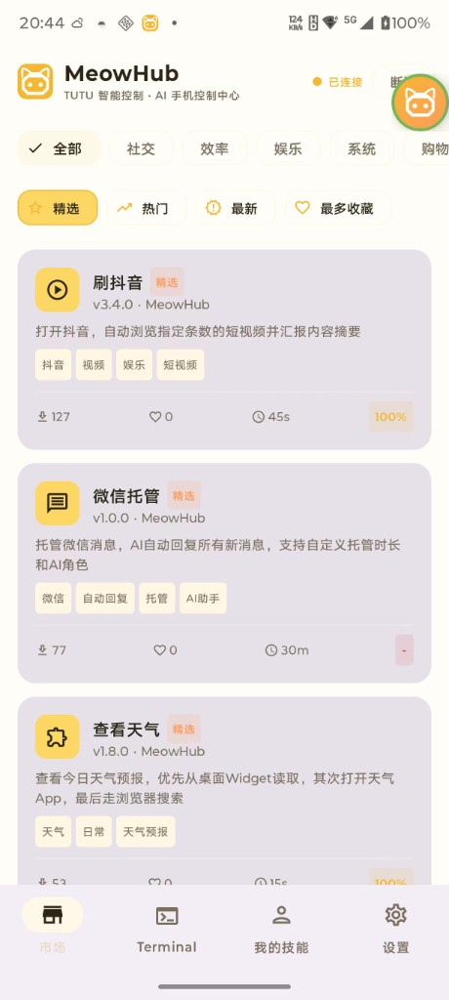
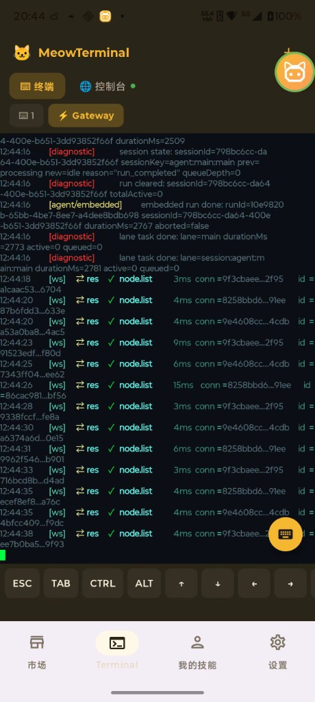
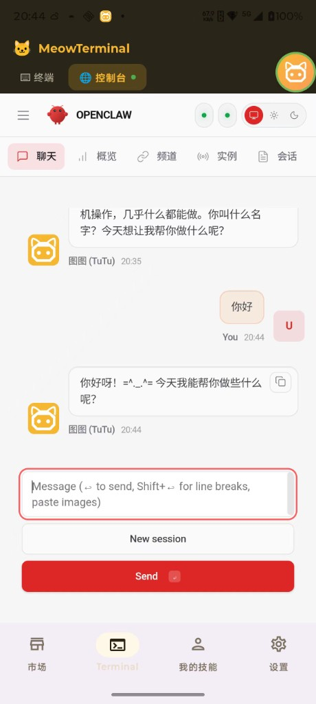

<p align="center">
  
</p>

<p align="center">
  <b>TUTU Smart Control · AI Phone Control Hub</b>
</p>

<p align="center">
  
  <br/>
  <code>SUB-BRAND · OpenClaw / MeowClaw</code>
  <br/>
  <b>Built-in Full OpenClaw Runtime</b>
  <br/>
  <span>The lobster way 🦞</span>
</p>

<p align="center">
  <b>AI Phone Avatar — Create Your Own Phone Automation Skills with AI</b>
</p>

<p align="center">
  <b>MeowHub × OpenClaw (The lobster way 🦞)</b><br/>
  Built-in Full OpenClaw, One-Tap Install on Android.
</p>

<p align="center">
  No manual Termux setup, no git clone on phone, no npm install, no fragile shell scripts.
</p>

<p align="center">
  <a href="https://tutuai.me">Official Website</a> •
  <a href="README_CN.md">中文文档</a> •
  <a href="docs/skill-development-guide.md">Skill Development Guide</a> •
  <a href="skills/">Skill Gallery</a> •
  <a href="CONTRIBUTING.md">Contributing</a>
</p>

<p align="center">
  <a href="LICENSE"></a>
  
  
  
  <a href="https://github.com/zhaojiaqi/MeowHub/stargazers"></a>
  <a href="https://github.com/zhaojiaqi/MeowHub/network/members"></a>
  <a href="https://github.com/zhaojiaqi/MeowHub/issues"></a>
</p>

---

## What is MeowHub?

MeowHub is an open-source Android app that turns your phone into an **AI-powered automation agent**. It serves as **the hands and feet of AI in the physical world** — enabling AI to truly "see" your screen, "tap" buttons, and "swipe" through apps to accomplish any task on your phone. MeowHub runs entirely on your device, is fully open-source, and uses a declarative **Skill Engine** so you can create and share automation skills in JSON — no coding required.

### Built-in OpenClaw, Not a Separate DIY Install

MeowHub now ships with a **fully integrated OpenClaw runtime** inside the app. This is not a "go install Termux, then run a few commands, then hope npm works" experience. Instead, MeowHub bundles the **complete OpenClaw-based MeowClaw stack** and can install it for users with **one tap**.

- **Built-in full OpenClaw** — bundled runtime, workspace, terminal, console, and Android bridge
- **One-tap install** — bootstrap, Node.js, npm, OpenClaw, workspace assets, and gateway are prepared automatically
- **No phone-side dependency hell** — no manual `git clone`, `npm install`, or package chasing on-device
- **More stable in bad network conditions** — key runtime assets are pre-packaged in the APK instead of fetched during first launch
- **Ready-to-use AI console** — terminal + web console are embedded directly in MeowHub

This matters because phone-side package installs are often the most fragile part of mobile AI-agent deployment: flaky network, broken mirrors, missing binaries, Android linker quirks, and inconsistent shell environments. MeowHub hides that complexity and delivers a **near out-of-box OpenClaw experience on Android**.

**Our vision:** Everyone can create and share their own phone AI avatar skills — giving AI the power to interact with the physical world.

### Why MeowHub? — A Fundamental Difference from Accessibility-Based Solutions

Most phone automation tools (Auto.js, Hamibot, etc.) rely on Android's **AccessibilityService**. This approach has critical flaws. MeowHub uses the **system-level ADB protocol**, solving these problems by design:

> **System-Level, Undetectable**
> Accessibility-based solutions run at the application layer. Major apps like WeChat, TikTok, Taobao, and Alipay actively detect Accessibility Services — triggering risk controls or even **account bans**. MeowHub operates through ADB at the system level, completely transparent to target apps, equivalent to real finger touches, **undetectable by any application**.

> **Stable & Reliable, One-Time Pairing**
> Accessibility permissions are fragile — broken by OS updates, inconsistent across OEM ROMs, auto-revoked or interrupted by system prompts. MeowHub uses the standard ADB protocol for consistent and stable behavior. Pair once, use permanently — no repeated authorization needed.

> **No Blind Spots**
> Accessibility can only interact with UI elements that have Accessibility nodes — games, Canvas, and WebView are out of reach. MeowHub supports touch, swipe, and key input at any screen position, completely framework-agnostic.

**In short:** Accessibility-based solutions are "sneaking around on someone else's turf" — always at risk of detection. MeowHub is "operating with system-level authority" — stable, secure, and undetectable.

---

### The Hands and Feet of AI — More Than Automation

MeowHub is not just another RPA tool. Through deep integration with Large Language Models (LLMs), it becomes **the bridge between AI and the physical world**:

- **AI can "See"** — Screenshots + vision analysis to understand anything on screen
- **AI can "Think"** — Intelligent decisions based on screen state and context
- **AI can "Act"** — ADB operations translate decisions into real touches, swipes, and inputs
- **AI can "Learn"** — Declarative Skill system enables capabilities to accumulate and evolve

MeowHub is one of the few open-source solutions that lets AI **truly reach physical devices and execute real-world actions**. It's not simulating, it's not calling APIs — it's using your phone, operating like a human.

---

### Key Features

- **Skill Engine** — A declarative JSON-based automation engine supporting 15+ step types: API calls, AI vision analysis, conditional branching, loops, user prompts, and more
- **AI-Powered Actions** — Leverages LLM (Large Language Model) to understand screenshots, locate UI elements, and make intelligent decisions
- **System-Level ADB** — Fully self-contained ADB implementation with mDNS discovery, TLS pairing (SPAKE2), and RSA key persistence — no PC required, zero detection risk
- **Built-in Full OpenClaw** — OpenClaw is embedded as a first-class capability inside MeowHub, not left to users as a separate manual install task
- **One-Tap MeowClaw Installation** — Pre-bundled bootstrap, Node.js, npm, OpenClaw runtime, workspace skills, and gateway configuration
- **Embedded Terminal + Console** — Switch between terminal output and OpenClaw web console directly inside the app
- **Skill Marketplace** — Browse, search, and run community-created skills with one tap
- **Overlay Control** — Floating panel for quick actions and real-time skill execution status
- **Open Ecosystem** — Create your own skills in JSON, contribute to the community, and build your personal phone AI avatar

### How It Works

```
┌──────────────────┐
│   MeowHub App    │
│  (Skill Engine)  │
└────────┬─────────┘
         │ ADB Protocol (TLS)
         ▼
┌──────────────────┐
│   ADB Daemon     │
└────────┬─────────┘
         │ shell: app_process
         ▼
┌──────────────────┐      ┌─────────────┐
│  TutuGui Server  │◄────►│  AI Provider │
│ (scrcpy-server)  │      │  (LLM API)   │
└────────┬─────────┘      └─────────────┘
         │ JSON Socket
         ▼
┌──────────────────┐
│ Touch / Swipe /  │
│ Screenshot / UI  │
└──────────────────┘
```

## Screenshots

<p align="center">
  
  
  
</p>

| View | Description |
|------|-------------|
| Skill Marketplace | Browse and run built-in MeowHub skills to start AI-driven phone automation quickly |
| Terminal | Inspect Gateway / OpenClaw runtime logs and debug startup or execution flow |
| Console | Open the embedded OpenClaw web console inside the app and chat directly with TuTu / MeowClaw |

## Getting Started

### Prerequisites

| Requirement | Version |
|------------|---------|
| Android    | 9+ (API 28), recommended 11+ for wireless debugging |
| Java       | 17 |
| Kotlin     | 2.3.10 |
| Android Gradle Plugin | 9.0.1 |
| Gradle     | 9.2.1 |
| NDK        | 28.x (CMake 3.22.1) |

### Build

1. **Clone the repository**

```bash
git clone https://github.com/zhaojiaqi/MeowHub.git
cd MeowHub
```

2. **Configure secrets**

Copy the example configuration and fill in your API keys:

```bash
cp secrets.properties.example secrets.properties
```

Edit `secrets.properties` with your credentials:

```properties
DOUBAO_API_KEY=your_api_key_here
DOUBAO_BASE_URL=https://ark.cn-beijing.volces.com/api/v3
DOUBAO_MODEL_ID=your_model_id_here
TUTU_APP_ID=your_app_id_here
TUTU_APP_SECRET=your_app_secret_here
```

> **Doubao API key**: Obtain from [Volcengine](https://www.volcengine.com/product/doubao). The AI provider is pluggable — contributions for other LLM providers (OpenAI, Gemini, etc.) are welcome!
>
> **TUTU_APP_ID / TUTU_APP_SECRET**: Used to connect to TUTU Smart Control device services. Visit the [project official website](https://tutuai.me), log in, go to **User Center** → **TUTU API KEY**, and click "Apply for API KEY" to get your App ID and App Secret.

3. **Build and install**

```bash
./gradlew assembleDebug
./gradlew installDebug
```

### First Run

1. Enable **Wireless Debugging** in Developer Settings on your Android device
2. Open MeowHub and follow the pairing wizard
3. Tap to install the built-in **MeowClaw / OpenClaw** runtime
4. Wait for MeowHub to automatically prepare the bundled bootstrap, Node.js, npm, OpenClaw, workspace, and gateway
5. Once connected, open the embedded terminal or console, or browse the Skill Marketplace and run a skill from "My Skills"

> **Why we emphasize this so much:** the app includes a **complete built-in OpenClaw distribution** designed for Android deployment. Users do **not** need to manually set up Termux, clone repositories, install Node.js, or troubleshoot npm dependency failures on the phone.

## Skill Ecosystem

MeowHub's power comes from its **extensible Skill system**. Skills are defined in simple JSON files and can automate virtually anything on your phone.

### Built-in Skills (19+)

| Category | Skills |
|----------|--------|
| Social | WeChat Auto Reply, WeChat Moments Like, Check Messages, Add Friend |
| Entertainment | Browse TikTok, TikTok Skip Ads, Browse Xiaohongshu |
| Daily | Check Weather, Daily News, Set Alarm, SMS Summary |
| Shopping | Taobao Search, Meituan Food |
| Tools | Screen Translate, Photo Cleanup, Storage Cleanup, WiFi Diagnose, Phone Health Check, Eye Comfort |

### Create Your Own Skill

Skills are JSON files with a declarative step-by-step structure. Here's a minimal example:

```json
{
  "name": "hello-world",
  "display_name": "Hello World",
  "version": "1.0.0",
  "steps": [
    {
      "id": "check_screen",
      "type": "ai_check",
      "prompt": "Describe what you see on the screen",
      "save_as": "screen_info"
    },
    {
      "id": "report",
      "type": "ai_summary",
      "prompt": "Summarize: ${screen_info}",
      "output": "result"
    }
  ]
}
```

For the complete guide, see **[Skill Development Guide](docs/skill-development-guide.md)**.

### Contributing Skills

We encourage everyone to create and share skills! Submit your skills via Pull Request to the [`skills/`](skills/) directory. See [CONTRIBUTING.md](CONTRIBUTING.md) for details.

## Tech Stack

| Layer | Technology |
|-------|-----------|
| UI | Jetpack Compose + Material 3 |
| State | ViewModel + StateFlow / SharedFlow |
| Navigation | Navigation Compose |
| Network | Kotlinx Serialization JSON + Custom Socket Protocol |
| ADB | Self-implemented ADB v2 (TLS, SPAKE2 Pairing) |
| Native | CMake + C++ (BoringSSL SPAKE2) |
| AI | Pluggable AI Provider (Doubao / Custom) |

## Project Structure

```
app/src/main/java/com/tutu/meowhub/
├── core/
│   ├── adb/          # Wireless ADB protocol stack
│   ├── auth/         # Token authentication
│   ├── engine/       # Skill execution engine (core)
│   ├── model/        # Data models
│   ├── network/      # MeowHub API client
│   ├── repository/   # Data repository
│   ├── service/      # Foreground services
│   └── socket/       # TutuSocketClient (TCP)
├── feature/
│   ├── debug/        # Debug panel
│   ├── engine/       # Skill engine ViewModel
│   ├── market/       # Skill marketplace UI
│   ├── myskills/     # My skills UI
│   ├── navigation/   # Main navigation
│   ├── overlay/      # Floating overlay
│   └── settings/     # Settings & ADB control
└── ui/theme/         # Material 3 theme
```

## Acknowledgements

MeowHub stands on the shoulders of these amazing open-source projects:

- **[scrcpy](https://github.com/Genymobile/scrcpy)** — The brilliant screen mirroring tool that inspired our device control layer. MeowHub's TutuGui Server is built upon scrcpy-server.
- **[Shizuku](https://github.com/RikkaApps/Shizuku)** — Pioneered the approach of using ADB for app-level privilege elevation on Android, which greatly inspired our wireless ADB implementation.

Special thanks to the developers and communities behind these projects. Their work has made MeowHub possible.

## Author

**zivzhao** — [Official Website](https://tutuai.me) · [GitHub](https://github.com/zhaojiaqi) · [Email](mailto:zivzhao@icloud.com)

## License

MeowHub is licensed under the **GNU General Public License v3.0** — see the [LICENSE](LICENSE) file for details.

```
Copyright (C) 2025 zivzhao and MeowHub Contributors

This program is free software: you can redistribute it and/or modify
it under the terms of the GNU General Public License as published by
the Free Software Foundation, either version 3 of the License, or
(at your option) any later version.
```

### Help Wanted

We especially welcome contributions that improve the **Skill Engine's core algorithms**:

- **RPA Execution Efficiency** — Optimize step execution flow, reduce unnecessary waits, improve command batching
- **AI Analysis Accuracy** — Better prompt engineering for `ai_check`/`ai_act` steps, reduce hallucinations, improve UI element recognition
- **Token Consumption Optimization** — Balance between AI analysis quality and token cost, implement smarter screenshot strategies, reduce redundant AI calls
- **Error Recovery** — More robust failure handling and retry strategies

These are active areas where the current implementation has room for significant improvement. If you're interested in RPA automation or LLM-powered agents, this is a great project to dive into!

## Star History

[](https://www.star-history.com/#zhaojiaqi/MeowHub&type=date&legend=top-left)

---

<p align="center">
  Made with ❤️ for the open-source community
</p>
