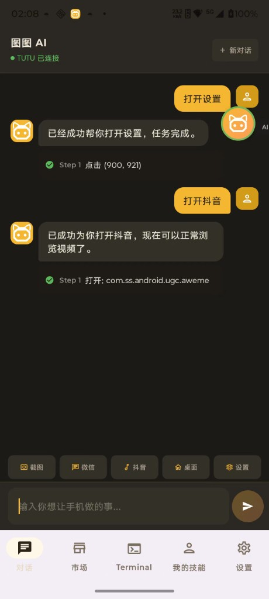

<p align="center">
  
</p>

<p align="center">
  <b>TUTU 智能控制 · AI 手机控制中心</b>
</p>

<p align="center">
  
  <br/>
  <code>SUB-BRAND · OpenClaw / MeowClaw</code>
  <br/>
  <b>Built-in Full OpenClaw Runtime</b>
  <br/>
  <span>The lobster way 🦞</span>
</p>

<p align="center">
  <b>AI 手机分身 — 让每个人都能制作自己的手机 AI 自动化技能</b>
</p>

<p align="center">
  <b>MeowHub × OpenClaw（The lobster way 🦞）</b><br/>
  内置完整 OpenClaw，Android 端一键安装。
</p>

<p align="center">
  不需要手动装 Termux，不需要在手机里 git clone，不需要自己跑 npm install。
</p>

<p align="center">
  <a href="https://tutuai.me">项目官网</a> •
  <a href="README.md">English</a> •
  <a href="docs/skill-development-guide.md">Skill 开发指南</a> •
  <a href="skills/">技能库</a> •
  <a href="CONTRIBUTING.md">参与贡献</a>
</p>

<p align="center">
  <a href="LICENSE"></a>
  
  
  
  <a href="https://github.com/zhaojiaqi/MeowHub/stargazers"></a>
  <a href="https://github.com/zhaojiaqi/MeowHub/network/members"></a>
  <a href="https://github.com/zhaojiaqi/MeowHub/issues"></a>
</p>

---

## MeowHub 是什么？

MeowHub 是一款开源 Android 应用，可以把你的手机变成一个 **AI 驱动的自动化代理**。它是 **AI 与物理世界交互的手和脚** — 让 AI 能够真正「看」屏幕、「点」按钮、「滑」操作，完成你在手机上的一切任务。MeowHub 完全本地运行、开源可审计，并通过声明式 **Skill 引擎** 让你用 JSON 定义和分享自动化技能，无需写代码。

### 内置 OpenClaw，不是让用户自己折腾安装

MeowHub 现在已经把 **完整 OpenClaw 运行时** 直接内置进 APP。这不是“你自己先装 Termux，再跑几条命令，再想办法把 npm 装好”的方案，而是把 **完整的 MeowClaw / OpenClaw 能力** 作为 APP 的一部分直接交付给用户，做到 **一键安装、一站式可用**。

- **内置完整 OpenClaw**：运行时、workspace、终端、控制台、Android Bridge 全部打包进 APP
- **一键安装**：bootstrap、Node.js、npm、OpenClaw、workspace 资源、gateway 配置都由 APP 自动准备
- **不需要手机端手动配环境**：不用自己 `git clone`、不用自己 `npm install`、不用临时补依赖
- **弱网环境更稳定**：关键运行时资源已经预打包到 APK，避免首次启动时在线下载失败
- **开箱即用的 AI 控制台**：终端和 OpenClaw 网页控制台都直接集成在 MeowHub 内

这件事非常重要，因为手机端 AI Agent 最容易失败的地方，往往不是模型本身，而是安装链路：网络不稳定、镜像源异常、二进制缺失、Android linker 兼容问题、Shell 环境不一致。MeowHub 把这些复杂度都收敛进 APP 内部，目标就是提供一个 **真正可落地、可交付、可一键运行的 Android OpenClaw 方案**。

**我们的愿景：** 让每个人都能创建和分享自己的手机 AI 分身技能 — 让 AI 真正拥有与物理世界交互的能力。

### 为什么选择 MeowHub？— 与无障碍方案的本质区别

市面上绝大多数手机自动化工具（Auto.js、Hamibot 等）都依赖 Android **无障碍服务（AccessibilityService）**，这存在根本性缺陷。MeowHub 采用 **系统底层 ADB 协议**，从架构层面彻底解决了这些问题：

> **系统底层，不可被检测**
> 无障碍方案运行在应用层，微信、抖音、淘宝、支付宝等主流 App 会主动检测无障碍服务，一旦发现即触发风控甚至 **封号处理**。MeowHub 基于 ADB 协议在系统底层执行操作，对目标 App 完全透明，等同于用户真实手指触摸，**无法被应用层检测**。

> **稳定可靠，一次配对永久生效**
> 无障碍服务受系统更新和厂商 ROM 差异影响，权限经常被自动回收或弹窗打断。MeowHub 基于标准 ADB 协议，行为一致且稳定，一次配对即可长期使用，无需反复授权。

> **操作无死角**
> 无障碍方案只能操作有 Accessibility 节点的 UI 元素，遇到游戏、Canvas、WebView 就无能为力。MeowHub 支持屏幕任意位置的触摸、滑动、按键，不受 UI 框架限制。

**一句话总结：** 无障碍方案是「在别人地盘上偷偷干活」，随时可能被发现和驱逐；MeowHub 是「以系统管理员身份正当操作」，稳定、安全、不可被检测。

---

### AI 的手和脚 — 不只是自动化

MeowHub 不仅仅是 RPA 工具。通过与大语言模型（LLM）的深度结合，它成为 **AI 与物理世界交互的桥梁**：

- **AI 能「看」** — 截图 + 视觉分析，理解屏幕上的任何内容
- **AI 能「想」** — 基于屏幕状态和上下文，做出智能决策
- **AI 能「做」** — 通过 ADB 底层操作，将决策转化为真实的触摸、滑动、输入
- **AI 能「学」** — 声明式 Skill 系统让能力不断积累和进化

MeowHub 是目前为数不多的，能让 AI **真正触达物理设备、执行真实操作**的开源方案。它不是在模拟，不是在调用 API — 它是在用你的手机，像人一样操作。

---

### 核心特性

- **TUTU AI 对话** — 直接用自然语言与图图 AI 对话。提问（支持联网搜索）、控制手机、运行技能，一个对话窗搞定一切。速度比 OpenClaw 对话**快 5 倍**，实时流式响应。
- **Skill 引擎** — 基于 JSON 的声明式自动化引擎，支持 15+ 种步骤类型：API 调用、AI 视觉分析、条件分支、循环、用户交互等
- **AI 驱动操作** — 利用大语言模型（LLM）理解屏幕截图、定位 UI 元素、做出智能决策
- **系统底层 ADB** — 完全自包含的 ADB 实现，支持 mDNS 发现、TLS 配对（SPAKE2）、RSA 密钥持久化——无需电脑，无检测风险
- **内置完整 OpenClaw** — OpenClaw 已作为 MeowHub 的一等能力直接集成，不再把复杂安装流程丢给用户
- **MeowClaw 一键安装** — 预打包 bootstrap、Node.js、npm、OpenClaw runtime、workspace 技能与 gateway 配置
- **内置终端 + 控制台** — 直接在 APP 内切换终端输出和 OpenClaw Web 控制台
- **技能市场** — 浏览、搜索并一键运行社区创建的技能
- **悬浮窗控制** — 浮动面板提供快捷操作和实时技能执行状态
- **开放生态** — 用 JSON 创建自己的技能，贡献到社区，打造你的专属手机 AI 分身

### v1.1.0 新特性

**设备控制 — 大幅扩展**
- TutuGui Server（scrcpy-server）升级至 v0312 版本：支持命令数从 27 个扩展至 **36 个**
- 新增 11 个 Socket 命令：`list_packages`、`get_app_info`、`force_stop_app`、`uninstall_app`、`install_apk`、`clear_app_data`、`send_sms`、`read_sms`、`get_device_info`、`execute_shell`、`call_state_event`
- 新增 7 个 HTTP Bridge 端点，OpenClaw AI 可直接通过结构化 API 管理应用、收发短信，无需依赖 Shell 命令

**AI 与对话增强**
- 高级设置新增模型检测功能，支持验证 API 配置是否有效
- 登录用户自动使用 TutuAI 代理服务，无需手动配置 API
- AI 消息支持 **Markdown 渲染**，表格支持全屏缩放、长按复制
- 优化 AI 提示词：常用应用直接映射包名（微信 -> `com.tencent.mm`），减少无效查询

**导航与体验优化**
- 使用 Jetpack Navigation Compose 全面重构导航 — 页面切换更流畅，返回逻辑更正确
- ADB 配对前增加设置须知弹窗
- 通知权限改为跳转系统设置页面

### 工作原理

```
┌──────────────────┐
│   MeowHub App    │
│  （Skill 引擎）   │
└────────┬─────────┘
         │ ADB 协议（TLS）
         ▼
┌──────────────────┐
│   ADB Daemon     │
└────────┬─────────┘
         │ shell: app_process
         ▼
┌──────────────────┐      ┌─────────────┐
│  TutuGui Server  │◄────►│  AI Provider │
│ (scrcpy-server)  │      │ （大模型 API）│
└────────┬─────────┘      └─────────────┘
         │ JSON Socket
         ▼
┌──────────────────┐
│ 触摸 / 滑动 /    │
│ 截图 / UI 树     │
└──────────────────┘
```

## 截图展示

<p align="center">
  
  
  
</p>

| 界面 | 说明 |
|------|------|
| **TUTU AI 对话** | 直接与图图 AI 对话——提问、联网搜索实时信息、或用自然语言控制手机。速度比 OpenClaw 对话**快 5 倍**。 |
| 技能市场 | 浏览和运行 MeowHub 内置技能，直接进入手机 AI 自动化工作流 |
| 终端 | 查看 Gateway / OpenClaw 运行日志，调试启动状态与执行过程 |

## 快速开始

### 环境要求

| 要求 | 版本 |
|------|------|
| Android | 9+（API 28），推荐 11+ 以支持无线调试 |
| Java | 17 |
| Kotlin | 2.3.10 |
| Android Gradle Plugin | 9.0.1 |
| Gradle | 9.2.1 |
| NDK | 28.x（CMake 3.22.1） |

### 构建步骤

1. **克隆仓库**

```bash
git clone https://github.com/zhaojiaqi/MeowHub.git
cd MeowHub
```

2. **配置密钥**

复制示例配置文件并填入你的 API 密钥：

```bash
cp secrets.properties.example secrets.properties
```

编辑 `secrets.properties`：

```properties
DOUBAO_API_KEY=你的API密钥
DOUBAO_BASE_URL=https://ark.cn-beijing.volces.com/api/v3
DOUBAO_MODEL_ID=你的模型ID
TUTU_APP_ID=你的应用ID
TUTU_APP_SECRET=你的应用密钥
```

> **豆包 API 密钥**：可从[火山引擎](https://www.volcengine.com/product/doubao)获取。AI Provider 采用插件化设计，欢迎贡献其他 LLM 适配（OpenAI、Gemini 等）！
>
> **TUTU_APP_ID / TUTU_APP_SECRET**：用于连接图图智控设备控制服务。请访问[项目官网 tutuai.me](https://tutuai.me)，登录后进入 **个人中心** → **TUTU API KEY**，点击「申请 API KEY」即可获得 App ID 和 App Secret。

3. **编译安装**

```bash
./gradlew assembleDebug
./gradlew installDebug
```

### 首次使用

1. 在 Android 设备的开发者选项中开启 **无线调试**
2. 打开 MeowHub，按照配对向导完成连接
3. 点击安装内置的 **MeowClaw / OpenClaw** 运行时
4. 等待 MeowHub 自动完成 bootstrap、Node.js、npm、OpenClaw、workspace 与 gateway 的准备
5. 安装完成后，可直接打开内置终端、控制台，或在“我的技能”与技能市场中开始使用

> **这里一定要强调：** MeowHub 提供的是 **内置完整 OpenClaw 的一键安装方案**。用户不需要在手机上手动配置 Termux、不需要手动拉仓库、不需要自己解决 npm 安装失败或依赖缺失问题。

## Skill 生态

MeowHub 的强大来自其 **可扩展的 Skill 系统**。技能通过简单的 JSON 文件定义，可以自动化手机上几乎所有操作。

### 内置技能（19+）

| 分类 | 技能 |
|------|------|
| 社交 | 微信托管自动回复、朋友圈自动点赞、查看微信消息、添加微信好友 |
| 娱乐 | 刷抖音、抖音看剧跳广告、刷小红书 |
| 日常 | 查看天气、每日新闻、设闹钟、短信摘要 |
| 购物 | 淘宝搜索、美团点餐 |
| 工具 | 屏幕翻译、照片清理、存储清理、WiFi 诊断、手机体检、护眼模式 |

### 创建你自己的 Skill

技能是具有声明式步骤结构的 JSON 文件。以下是一个最简示例：

```json
{
  "name": "hello-world",
  "display_name": "你好世界",
  "version": "1.0.0",
  "steps": [
    {
      "id": "check_screen",
      "type": "ai_check",
      "prompt": "描述你在屏幕上看到的内容",
      "save_as": "screen_info"
    },
    {
      "id": "report",
      "type": "ai_summary",
      "prompt": "总结一下：${screen_info}",
      "output": "result"
    }
  ]
}
```

完整开发指南请查看 **[Skill 开发指南](docs/skill-development-guide.md)**。

### 贡献技能

我们鼓励每个人创建和分享技能！通过 Pull Request 将你的技能提交到 [`skills/`](skills/) 目录即可。详见 [CONTRIBUTING.md](CONTRIBUTING.md)。

## 技术栈

| 层级 | 技术选型 |
|------|---------|
| UI | Jetpack Compose + Material 3 |
| 状态管理 | ViewModel + StateFlow / SharedFlow |
| 导航 | Navigation Compose |
| 网络 | Kotlinx Serialization JSON + 自定义 Socket 协议 |
| ADB 协议 | 自实现 ADB v2（TLS、SPAKE2 配对） |
| 原生层 | CMake + C++（BoringSSL SPAKE2） |
| AI | 可插拔 AI Provider（豆包 / 自定义） |

## 项目结构

```
app/src/main/java/com/tutu/meowhub/
├── core/
│   ├── adb/          # 无线 ADB 协议栈
│   ├── auth/         # Token 认证
│   ├── engine/       # Skill 执行引擎（核心）
│   ├── model/        # 数据模型
│   ├── network/      # MeowHub API 客户端
│   ├── repository/   # 数据仓库
│   ├── service/      # 前台服务
│   └── socket/       # TutuSocketClient（TCP）
├── feature/
│   ├── chat/         # TUTU AI 对话模块
│   ├── debug/        # 调试面板
│   ├── engine/       # Skill 引擎 ViewModel
│   ├── market/       # 技能市场 UI
│   ├── myskills/     # 我的技能 UI
│   ├── navigation/   # 主导航
│   ├── overlay/      # 悬浮窗
│   └── settings/     # 设置与 ADB 控制
└── ui/theme/         # Material 3 主题
```

## 致谢

MeowHub 站在以下优秀开源项目的肩膀上：

- **[scrcpy](https://github.com/Genymobile/scrcpy)** — 杰出的屏幕镜像工具，启发了我们的设备控制层。MeowHub 的 TutuGui Server 基于 scrcpy-server 构建。
- **[Shizuku](https://github.com/RikkaApps/Shizuku)** — 开创了利用 ADB 实现应用级权限提升的方案，极大地启发了我们的无线 ADB 实现。

特别感谢这些项目背后的开发者和社区，他们的工作使 MeowHub 成为可能。

## 作者

**zivzhao** — [项目官网](https://tutuai.me) · [GitHub](https://github.com/zhaojiaqi) · [Email](mailto:zivzhao@icloud.com)

## 许可证

MeowHub 基于 **GNU 通用公共许可证 v3.0** 发布——详见 [LICENSE](LICENSE) 文件。

```
Copyright (C) 2025 zivzhao and MeowHub Contributors

This program is free software: you can redistribute it and/or modify
it under the terms of the GNU General Public License as published by
the Free Software Foundation, either version 3 of the License, or
(at your option) any later version.
```

### 期待你的贡献

我们特别欢迎对 **Skill 引擎核心算法** 的优化贡献：

- **RPA 执行效率** — 优化步骤执行流程、减少不必要的等待、提升命令批处理效率
- **AI 分析准确性** — 改进 `ai_check`/`ai_act` 步骤的提示词工程，减少幻觉，提升 UI 元素识别精度
- **Token 消耗优化** — 在 AI 分析质量与 Token 成本之间取得平衡，实现更智能的截图策略，减少冗余 AI 调用
- **错误恢复** — 更健壮的失败处理和重试策略

这些都是当前实现中仍有显著提升空间的方向。如果你对 RPA 自动化或 LLM 驱动的 Agent 感兴趣，这是一个非常值得深入的项目！

## Star History

[](https://www.star-history.com/#zhaojiaqi/MeowHub&type=date&legend=top-left)

---

<p align="center">
  Made with ❤️ for the open-source community
</p>
